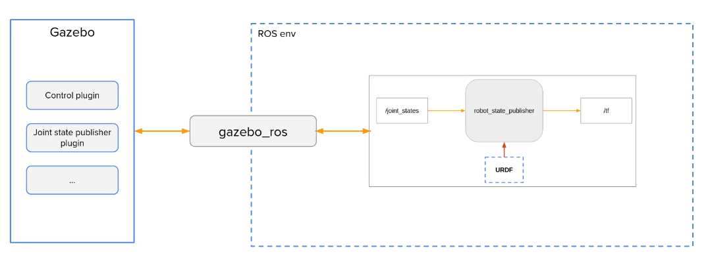

# Gazebo
We will simulate all physics as well as the work with the simulation program which is independet from ROS. We can connect it with the `gazebo_ros` bridge. The package will then interact wirh the robot_state_publisher which will publish the modell data of our robot.




Inside Gazebo we can define plugins which will simulate the hardware.
These Plugins let uns interact with the robot. So we can control the wheels and get date from the sensors.

## Comands

By default ros2 and gazebo are not communicating with eatchother. To see the topics of gazebo you need
to use ``gz topic -l``
Then you can build a bridge between ros2 and gazebo.


## Launching
When launching gazebo inside a launch file the `setup.bash` needs to be sourced

```bash
source /usr/share/gazebo/setup.sh 
```

Then it is possible to launch 
```bash
ros2 launch gazebo_ros gazebo.launch.py
```

## Spawning manually

There are three commands you need to use. At first you need a program to host your urdf file
For executing use following command
```bash
ros2 run robot_state_publisher robot_state_publisher --ros-args -p robot_description:="$(xacro robot.urdf.xacro)"
```

After that you need to launch gazebo in ros
```bash
ros2 launch gazebo_ros gazebo.launch.py
```

Then it is nessesary to spawn the for that execute the spawn entity script inside the gazebo_ros package
Use the robot name you defined inside the xml file
```bash
ros2 run gazebo_ros spawn_entity.py -topic robot_description -entity <robot_name>
```

## Simulation launchfile
This is a basic gazebo ros launch file running all nessesary components
```xml
<launch>
    <let name="urdf_path" 
         value="$(find-pkg-share my_robot_description)/urdf/robot.urdf.xacro" />

        <let name="rviz_config_path" 
         value="$(find-pkg-share my_robot_description)/rviz/robot.rviz" />

    <node pkg="robot_state_publisher" exec="robot_state_publisher">
        <param name="robot_description" 
               value="$(command 'xacro $(var urdf_path)')" />
    </node>

    <include file="$(find-pkg-share gazebo_ros)/launch/gazebo.launch.py"/>

    <node pkg="gazebo_ros" exec="spawn_entity.py" 
          args="-topic robot_description -entity robot"/>
</launch>    
```

The launch file is depending on three packages, gazebo_ros, robot_state_publisher and my_robot_description.
To make sure all requiered dependencies are present when the launch file is executed
Add following lines to `package.xml`

```xml
<exec_depend>my_robot_description</exec_depend>
<exec_depend>robot_state_publisher</exec_depend>
<exec_depend>gazebo_ros</exec_depend>
```
